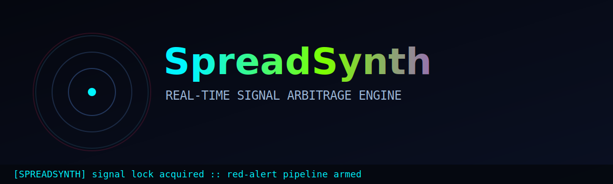
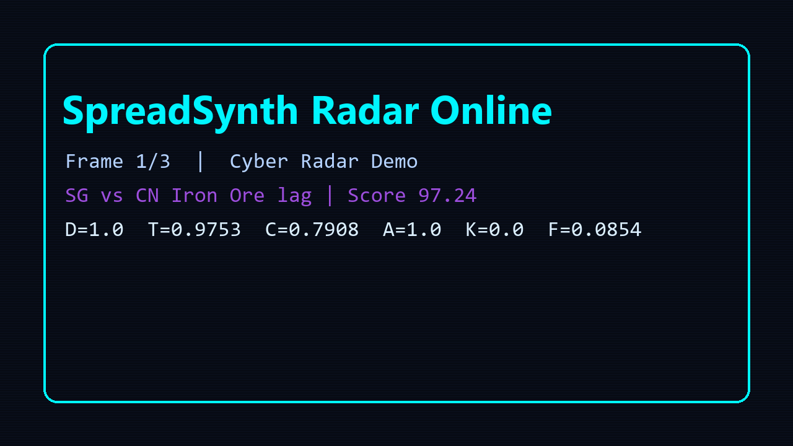
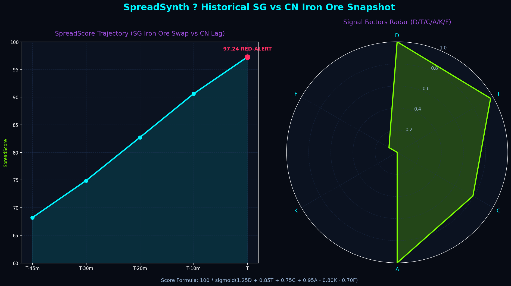

# SpreadSynth ⚡

> **你不追热点，你截流热点。**
>
> SpreadSynth 是一个“时间差套利引擎”：实时捕捉不同平台/地区的信息差、热度差、价格差，并自动触发执行动作（预警、报告、Webhook、内容草稿）。

## 🔴 Live Opportunities (Simulated • 2026-03-18)

> Generated by `SpreadScorer` demo logic. Higher score = higher execution urgency.

| Opportunity | Lead vs Lag | SpreadScore | Trigger | Suggested Action |
|---|---|---:|---|---|
| Browser Automation MCP adoption gap | US → CN | **92.93** | red-alert | 20分钟内发布中文技术解读 + Demo短视频 |
| US AI Agent frameworks discussion lag | US → CN | **92.78** | red-alert | 立即产出“框架选型对比卡”并分发到开发者社区 |
| Singapore Iron Ore Swap vs DCE lag | SG → CN | **95.69** | red-alert | 启动商品价差风控预警 + 交易前检查流程 |





> 视觉素材占位说明（发布前请替换为真实素材）
>
> - `./assets/logo-spreadsynth-neon.svg`：项目动态 SVG Logo（赛博雷达扫线 + 霓虹呼吸动画）
> - `./assets/demo-spreadsynth-wow.gif`：15~20 秒核心演示 GIF（雷达盘 -> 分数突破 90 -> 红警态 -> Telegram 推送动效）
> - `./assets/backtest-01-score-timeline.png`：24h 分数时间线（机会出现与衰减）
> - `./assets/backtest-02-source-divergence.png`：多源差值对比图（US/SG vs CN）
> - `./assets/backtest-03-alert-log.png`：告警日志截图（含 trigger 与 action）
> - `./assets/backtest-04-action-conversion.png`：动作执行结果图（触达/点击/执行率）

> **Visuals are evolving; real-time radar recording coming in 0.1.1.**

---

## 为什么它值得你点 Star

传统 dashboard 只会告诉你“发生了什么”。

**SpreadSynth 会告诉你：**

1. **机会是否还在窗口期**（Timeliness）
2. **这个机会是否可信**（Confidence）
3. **现在就该执行什么动作**（Actionability）

你看到的不是图表，是 **可执行套利信号**。

---

## 核心能力

- 多源采集：API / RSS / 爬虫统一归一化
- 实时评分：Spread Score（0-100）
- 自动动作：Telegram/飞书提醒、Webhook、报告摘要
- 24h 回放墙：复盘机会出现-放大-衰减全过程
- WOW 模式：当 Score > 90，触发“红色战报态”+ 战报自动推送动效

---

## Spread Score 公式

$$
SpreadScore = 100 * sigmoid(1.25D + 0.85T + 0.75C + 0.95A - 0.80K - 0.70F)
$$

- **D (Divergence)**：平台/地区差值强度（越大越有套利空间）
- **T (Timeliness)**：时效（越新越高）
- **C (Confidence)**：可信度（源可靠性+解析质量+交叉验证）
- **A (Actionability)**：可执行性（是否能自动触发动作）
- **K (Competition Saturation)**：竞争拥挤度（越高越扣分）
- **F (Friction)**：执行摩擦（延迟、成本、权限等）

推荐阈值：

- `>= 75`：立即执行
- `55~74`：观察并轻量执行
- `<55`：归档

---

## 1 分钟启动（Docker Compose）

```bash
git clone https://github.com/your-org/spreadsynth.git
cd spreadsynth
docker compose up --build
```

打开：

- Demo UI: http://localhost:8501
- API Docs: http://localhost:8000/docs

---

## Demo 场景（内置）

### 场景 A：跨境技术热点差（US → CN）

- 源：GitHub Trending / HN / X / RSS
- 每 15 分钟计算关键词热度增长率
- 当 `SpreadScore >= 75` 自动触发：
  - 生成机会摘要
  - 推送到 Telegram
  - 生成内容草稿

### 场景 B：大宗商品价差监控（可扩展）

- 源：交易 API / 财经 RSS / 自建采集
- 计算跨市场价差及衰减速度
- 超阈值触发执行流（报警/报告/策略队列）

---

## 架构总览

```text
[API/RSS/Crawler] -> [Normalizer] -> [Spread Engine] -> [Realtime UI]
                                     |-> [Action Queue]
                                     |-> [Battle Report Generator]
                                     |-> [Replay Store]
```

---

## WOW Factor：Score > 90 时发生什么

当实时 Score 突破 90：

1. UI 进入 **RED ALERT** 模式（雷达盘变红 + 脉冲）
2. 自动生成“战报摘要”（机会来源、置信度、建议动作）
3. 触发“模拟 Telegram 推送动效”
4. 在右侧日志墙落地事件 ID，支持后续复盘

---

## 24h 回测截图墙





---

## CLI（规划）

```bash
spreadsynth scan --window 24h --min-score 70
spreadsynth replay --id evt_2026_03_18_001
spreadsynth action run --template hotspot-lag
```

---

## Roadmap

- [x] 多源归一化评分引擎
- [x] Demo UI + 高分战报动效
- [ ] Support for real-time Iron Ore futures API integration
- [ ] Plugin SDK
- [ ] 策略模板市场
- [ ] 自动阈值 A/B 优化
- [ ] 团队协作看板

---

## License

MIT
